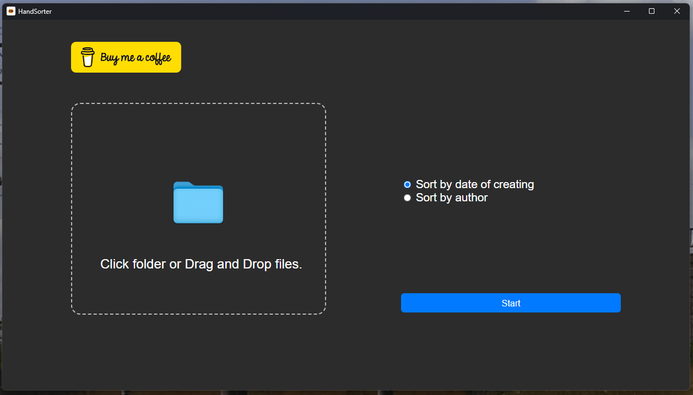

# FileSorter

<br />
Is app witen on Electron.js + jQuery. You can drop photos, select folder and sort by date of creating photos.  

## Screenshot


# Start and build
For start project use command
```
    > npm install
```
For run use command
```
    > npm start
```

For build for your OS use command:
```
    > electron-packager <project_dir_name> <app_name> --platform=<your paltform (win32, linux, darwin(macOs))> --arch=<x64 or x86>
```


<a href="https://www.buymeacoffee.com/mmakaliuk" target="_blank"></a>
